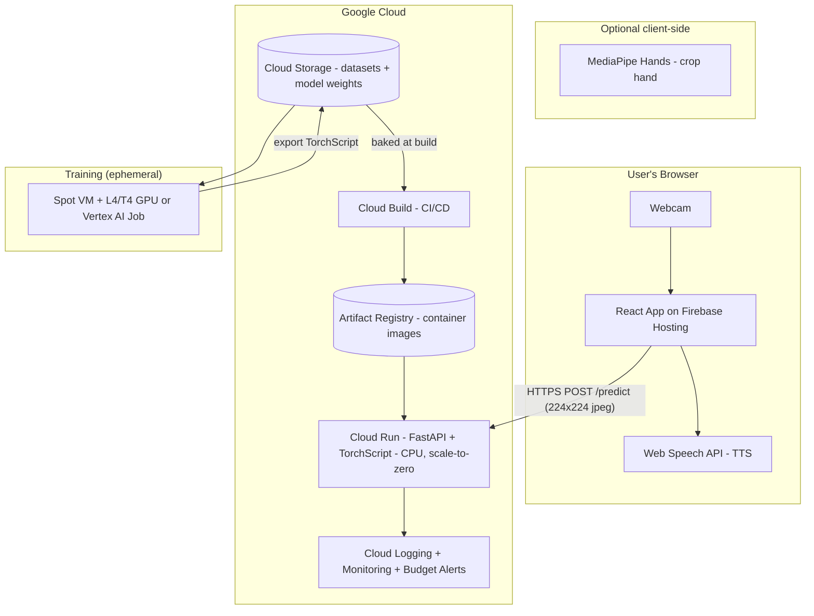

# SignSense — Full Build & GCP Deployment Plan

> From current state → trained model → production deployment on Google Cloud → live.
> Written to be **cost-effective**, reproducible, and shippable by one engineer.

**Audience:** you (the builder), thinking simultaneously as a **software engineer** (clean, reproducible, automated), a **system architect** (scalable, secure, observable), and a **user** (fast, accurate, works on a normal laptop webcam).

---

## 0. TL;DR — The Strategy in One Page

| Decision | Choice | Why |
|---|---|---|
| **Where to train** | Compute Engine **Spot VM + 1× NVIDIA L4/T4** (or Vertex AI custom job) | MobileNetV2 transfer learning is tiny. A spot GPU costs **cents/hour**; full training run ≈ **$0.50–$2**. |
| **Where to serve the model** | **Cloud Run (CPU-only), scale-to-zero** | MobileNetV2 inference on CPU is ~20–60 ms. No GPU needed for serving = **massive cost savings**. Pay only per request. |
| **Where to host the frontend** | **Firebase Hosting** (free tier + global CDN + auto HTTPS) | Static React build. Effectively **$0** at low traffic. |
| **Model format** | Export to **TorchScript** (or ONNX) | Smaller container, faster cold start, no training deps at serve time. |
| **Artifact storage** | **Google Cloud Storage (GCS)** | Datasets + model weights versioned in one bucket. |
| **CI/CD** | **Cloud Build** → **Artifact Registry** → **Cloud Run** | One `git push` ships a new backend. |
| **Accuracy fix (critical)** | Crop the hand with **MediaPipe** before classifying, and train on cropped images | Today the model sees the whole frame; real users have cluttered backgrounds. This is the #1 accuracy lever. |
| **Est. monthly cost (low traffic)** | **~$0–$8/month** | Scale-to-zero backend + free-tier frontend + a few GB in GCS. |

**Critical path:** Fix config & accuracy gap → train on GCP → export model → containerize backend → deploy Cloud Run → deploy frontend → wire CI/CD → add monitoring + budget alerts → go live.

---

## 1. Current-State Assessment (what we're starting from)

### What already works
- **PyTorch training pipeline** (`ml-model/3_train_model.py`): MobileNetV2 transfer learning, two-phase (head-only then fine-tune), saves `asl_model_final.pth`.
- **FastAPI inference backend** (`web-app/backend/app/main.py`): loads weights, `/predict` endpoint, softmax confidence, class reconciliation.
- **React/Vite frontend** (`web-app/frontend`): webcam capture at 224×224, posts frames, builds sentences, browser TTS.

### Gaps that block production (addressed in this plan)
1. **Hardcoded developer paths** (`E:\Lavindu\HCI\...`) in training scripts → must be config/env-driven.
2. **No trained artifact in repo** — `asl_model_final.pth` is gitignored and absent. Backend crashes on startup without it.
3. **Class-count mismatch** — `class_mapping.json` has 40 classes; model trained on 36; backend uses a fragile heuristic. Make this deterministic.
4. **Accuracy gap** — training/inference use the **full frame**, not a **cropped hand**. Real backgrounds will tank accuracy. Add MediaPipe cropping on both sides.
5. **CORS = `*`** and no auth/rate-limiting → lock down for production.
6. **No containerization, no IaC, no CI/CD, no monitoring**.
7. **Heavy container risk** — default `torch` wheel pulls CUDA (~2.5 GB). Use the **CPU-only** wheel for serving (~800 MB image).
8. **Frontend API URL hardcoded** to `localhost:8000` → must be environment-driven.

---

## 2. Target Architecture



**Key principle:** the **serving path has zero GPU and scales to zero**. GPUs are used only for the short, ephemeral training jobs.

---

## 3. Cost Model (be honest about money)

Assumes `us-central1`, low-to-moderate traffic (a demo / portfolio / early product).

| Item | Config | Est. cost |
|---|---|---|
| **Training (one-off / occasional)** | Spot VM `g2-standard-4` + 1× L4, ~2 hrs | **~$0.50–$1.50 per run** |
| **Model serving** | Cloud Run, 1 vCPU / 1 GiB, scale-to-zero, ~50k req/mo | **~$0–$5/mo** (often within free tier) |
| **Frontend hosting** | Firebase Hosting, free tier | **$0** (10 GB transfer/mo free) |
| **Artifact Registry** | A few container images, <2 GB | **~$0.10/mo** |
| **Cloud Storage** | Datasets (~5 GB) + models (<100 MB) | **~$0.13/mo** |
| **Cloud Build** | First 120 build-min/day free | **$0** typically |
| **Logging/Monitoring** | Free tier (50 GiB logs/mo) | **$0** |
| **Total (low traffic)** | | **≈ $0–$8 / month** |

**Cost guardrails (set these on day one):**
- A **GCP Budget** with email alerts at 50% / 90% / 100% of (e.g.) $10/month.
- Cloud Run **`--max-instances`** cap (e.g. 5) to prevent runaway scaling bills.
- Delete the **training VM** immediately after each run (or use auto-delete).
- Lifecycle rule on the GCS bucket to delete old raw datasets / move to Nearline.

---

## 4. Phased Build Plan

Each phase has: **Goal → Steps → Deliverables → Done-when**.

---

### Phase 0 — Foundations & Reproducibility (local, ~half a day)

**Goal:** Make the project run anywhere without hardcoded paths, with pinned dependencies.

**Steps:**
1. **Kill hardcoded paths.** Replace the `E:\Lavindu\HCI\...` defaults in `3_train_model.py` (and siblings) with env vars and a `.env.example`.

   Create `ml-model/.env.example`:
   ```dotenv
   PROCESSED_DATASET_PATH=./datasets/processed
   MODEL_SAVE_PATH=./models
   LOGS_PATH=./logs
   ```
   The training script already calls `load_dotenv()` and resolves relative paths — just change the **defaults** to relative ones.

2. **Pin dependencies.** Generate locked requirements for reproducibility:
   ```bash
   pip freeze > ml-model/requirements.lock.txt
   ```
   For the backend, pin versions and split CPU torch (see Phase 4).

3. **Make class mapping deterministic.** Decide ONE canonical class set. Recommended: train on the **same 36 alphanumeric classes** the backend expects (`0-9`, `A-Z`), OR include `SPACE`/`DEL`/`NOTHING` and update the backend to stop guessing. Write the authoritative `class_mapping.json` next to the model and load it verbatim (remove the heuristic filter).

4. **Add a `LICENSE` file** (README claims MIT but none exists) and scrub the report placeholders.

**Deliverables:** env-driven config, pinned deps, deterministic classes, license.
**Done-when:** `python 3_train_model.py` runs on a clean machine using only `.env`.

---

### Phase 1 — Accuracy Hardening (the part users actually feel)

**Goal:** The model must work with a **real webcam and a messy background**, not just clean dataset crops.

This is the single biggest lever on whether the product feels "good" or "broken." Two changes:

1. **Train on cropped hands.** You already have `2b_create_cropped_dataset.py`. Use MediaPipe to detect+crop the hand, pad to square, then resize to 224×224. Retrain on this cropped dataset so train/serve distributions match.

2. **Crop at inference too.** Add a hand-detection step before classification. Two options:

   - **Option A (recommended for cost & latency): client-side MediaPipe Tasks.** Run `@mediapipe/tasks-vision` HandLandmarker in the browser, crop to the hand bounding box, and send only the crop. Keeps the backend tiny and pushes compute to the client for free.
   - **Option B: server-side MediaPipe.** Add `mediapipe` to the backend and crop in `/predict`. Simpler code, but adds ~150 MB to the image and CPU cost per request.

3. **Confidence + temporal smoothing.** Keep the frontend's 80% confidence gate. Add a short majority-vote window (you already have `utils/temporal_smoother.py` — port that logic to the frontend or backend) so a single bad frame doesn't insert a wrong letter.

4. **Define acceptance metrics.** Hold out a **test set the model never saw** AND record a small **real-world webcam clip set** (you, in your actual room). Targets to ship:
   - Test-set top-1 accuracy ≥ **95%** (clean).
   - Real-world per-letter accuracy ≥ **80%** with the confidence gate on.

**Deliverables:** cropped training dataset, hand-crop at inference, smoothing, a real-world eval harness.
**Done-when:** you can fingerspell your name in front of a normal background and it reads correctly.

> Note: If real-world accuracy stays poor even after cropping, that's the signal to consider **landmark-based classification** (feed 21 hand landmarks → small MLP) instead of raw pixels. It's more robust to lighting/background and even cheaper to serve. Keep this as a fast-follow.

---

### Phase 2 — Train on GCP (cost-effective)

**Goal:** Produce a versioned, exported model artifact in GCS.

#### 2.1 Project & APIs
```bash
# Set your project
gcloud config set project YOUR_PROJECT_ID

# Enable required services
gcloud services enable \
  run.googleapis.com \
  artifactregistry.googleapis.com \
  cloudbuild.googleapis.com \
  storage.googleapis.com \
  compute.googleapis.com \
  aiplatform.googleapis.com
```

#### 2.2 Create the storage bucket
```bash
export REGION=us-central1
export BUCKET=gs://YOUR_PROJECT_ID-signsense

gcloud storage buckets create $BUCKET --location=$REGION --uniform-bucket-level-access

# Upload the prepared dataset
gcloud storage cp -r ml-model/datasets/processed $BUCKET/datasets/processed
```

#### 2.3 Option A — Spot GPU VM (cheapest, full control)
```bash
gcloud compute instances create signsense-train \
  --zone=${REGION}-a \
  --machine-type=g2-standard-4 \
  --accelerator=type=nvidia-l4,count=1 \
  --provisioning-model=SPOT \
  --instance-termination-action=DELETE \
  --maintenance-policy=TERMINATE \
  --image-family=common-cu123-debian-11 \
  --image-project=deeplearning-platform-release \
  --boot-disk-size=100GB \
  --metadata="install-nvidia-driver=True"
```
Then SSH in, pull the repo + dataset from GCS, run training, upload artifacts:
```bash
gcloud compute ssh signsense-train --zone=${REGION}-a

# inside the VM:
git clone https://github.com/JAlavindu/sign-language-to-text-speech.git
cd sign-language-to-text-speech
pip install -r ml-model/requirements.txt
gcloud storage cp -r gs://YOUR_PROJECT_ID-signsense/datasets/processed ml-model/datasets/processed

# train (env-driven paths from Phase 0)
export PROCESSED_DATASET_PATH=ml-model/datasets/processed
export MODEL_SAVE_PATH=ml-model/models
python ml-model/3_train_model.py

# export to TorchScript (see 2.5) then upload
gcloud storage cp ml-model/models/asl_model_final.pth $BUCKET/models/v1/asl_model_final.pth
gcloud storage cp ml-model/models/asl_model_ts.pt    $BUCKET/models/v1/asl_model_ts.pt
gcloud storage cp ml-model/datasets/processed/class_mapping.json $BUCKET/models/v1/class_mapping.json
```
**Immediately delete the VM** when done (Spot + `--instance-termination-action=DELETE` helps, but verify):
```bash
gcloud compute instances delete signsense-train --zone=${REGION}-a --quiet
```

#### 2.4 Option B — Vertex AI Custom Job (managed, no VM babysitting)
Package the training script as a container or use a prebuilt PyTorch image, then:
```bash
gcloud ai custom-jobs create \
  --region=$REGION \
  --display-name=signsense-train \
  --worker-pool-spec=machine-type=g2-standard-4,accelerator-type=NVIDIA_L4,accelerator-count=1,replica-count=1,container-image-uri=us-docker.pkg.dev/YOUR_PROJECT_ID/signsense/trainer:latest
```
Use Option B once you want repeatable, logged, hands-off runs (good for retraining as you add data).

#### 2.5 Export the model for serving (do this at the end of training)
Add an export step so serving never needs the training stack. Proposed `ml-model/export_model.py`:
```python
import torch, json, os
from torchvision import models
import torch.nn as nn

NUM_CLASSES = 36  # or whatever your canonical mapping says
WEIGHTS = os.environ["MODEL_SAVE_PATH"] + "/asl_model_final.pth"
OUT = os.environ["MODEL_SAVE_PATH"] + "/asl_model_ts.pt"

m = models.mobilenet_v2(weights=None)
in_f = m.classifier[1].in_features
m.classifier = nn.Sequential(
    nn.Dropout(0.5), nn.Linear(in_f, 256), nn.ReLU(),
    nn.Dropout(0.3), nn.Linear(256, NUM_CLASSES),
)
m.load_state_dict(torch.load(WEIGHTS, map_location="cpu"))
m.eval()

example = torch.randn(1, 3, 224, 224)
ts = torch.jit.trace(m, example)
ts.save(OUT)
print("Saved TorchScript to", OUT)
```

**Deliverables:** `asl_model_ts.pt` + `class_mapping.json` in `gs://.../models/v1/`.
**Done-when:** artifacts are in GCS and the export loads + predicts on CPU.

---

### Phase 3 — Backend Hardening for Production

**Goal:** A small, secure, fast FastAPI service that loads the TorchScript model.

**Changes to `web-app/backend/app/main.py`:**
1. **Load TorchScript** instead of rebuilding the architecture:
   ```python
   model = torch.jit.load(MODEL_PATH, map_location="cpu")
   model.eval()
   ```
2. **Load class names verbatim** from the bundled `class_mapping.json` (delete the heuristic filter — Phase 0 made classes deterministic).
3. **Lock CORS** to your real frontend origin via env var:
   ```python
   origins = os.getenv("ALLOWED_ORIGINS", "http://localhost:5173").split(",")
   ```
4. **Add readiness + liveness**: keep `/` healthy, add `/healthz` that returns 200 only after the model is loaded (Cloud Run uses this).
5. **Replace deprecated `@app.on_event("startup")`** with a FastAPI `lifespan` handler.
6. **Thread safety / concurrency:** set `torch.set_num_threads(1)` and rely on Cloud Run concurrency; benchmark concurrency 4–8 per instance.
7. **Optional minimal abuse protection:** request size limit (reject >1 MB uploads), and basic per-IP rate limiting if you expose it publicly.

**Deliverables:** hardened `main.py`, `class_mapping.json` bundled in `artifacts/`.
**Done-when:** `uvicorn app.main:app` serves `/predict` using the TorchScript model with locked CORS.

---

### Phase 4 — Containerize the Backend (small image)

**Goal:** A lean, CPU-only container (~800 MB instead of ~2.5 GB).

Create `web-app/backend/requirements.txt` (pinned, CPU torch):
```
--extra-index-url https://download.pytorch.org/whl/cpu
fastapi==0.115.*
uvicorn[standard]==0.30.*
python-multipart==0.0.*
torch==2.4.*+cpu
torchvision==0.19.*+cpu
pillow==10.*
numpy==1.26.*
```

Create `web-app/backend/Dockerfile`:
```dockerfile
FROM python:3.11-slim

ENV PYTHONUNBUFFERED=1 PIP_NO_CACHE_DIR=1
WORKDIR /app

# System deps for Pillow
RUN apt-get update && apt-get install -y --no-install-recommends \
    libjpeg62-turbo libpng16-16 && rm -rf /var/lib/apt/lists/*

COPY requirements.txt .
RUN pip install --no-cache-dir -r requirements.txt

# App code + model artifact (baked in for fast cold starts)
COPY app ./app
COPY artifacts ./artifacts

# Cloud Run provides $PORT
ENV PORT=8080
CMD ["sh", "-c", "uvicorn app.main:app --host 0.0.0.0 --port ${PORT}"]
```

Create `web-app/backend/.dockerignore`:
```
__pycache__/
*.pyc
venv/
.env
*.pth
!artifacts/asl_model_ts.pt
```

**Bake the model into the image** (download from GCS during build) for the fastest cold start. Alternatively, mount from GCS at startup if the model is large — but at <30 MB, baking it in is best.

**Deliverables:** `Dockerfile`, `.dockerignore`, pinned CPU requirements.
**Done-when:** `docker build` succeeds and `docker run -p 8080:8080` answers `/predict` locally.

---

### Phase 5 — Deploy Backend to Cloud Run

**Goal:** Public, autoscaling, scale-to-zero HTTPS endpoint.

```bash
export REGION=us-central1
export REPO=signsense
export IMG=us-docker.pkg.dev/YOUR_PROJECT_ID/$REPO/backend:v1

# 1. Create Artifact Registry repo (once)
gcloud artifacts repositories create $REPO \
  --repository-format=docker --location=$REGION

# 2. Build the image with Cloud Build (no local Docker needed)
gcloud builds submit web-app/backend --tag $IMG

# 3. Deploy to Cloud Run
gcloud run deploy signsense-backend \
  --image $IMG \
  --region $REGION \
  --platform managed \
  --allow-unauthenticated \
  --cpu 1 --memory 1Gi \
  --concurrency 8 \
  --min-instances 0 \
  --max-instances 5 \
  --set-env-vars "ALLOWED_ORIGINS=https://YOUR_FRONTEND_DOMAIN"
```

**Cost knobs:**
- `--min-instances 0` → scale to zero (cheapest; accepts ~1–3 s cold start).
- For a smoother demo, set `--min-instances 1` (small always-on cost, ~a few $/mo) and accept the trade-off.
- `--max-instances 5` caps the bill.

Grab the service URL:
```bash
gcloud run services describe signsense-backend --region $REGION --format='value(status.url)'
```

**Deliverables:** live `https://signsense-backend-xxxx.run.app`.
**Done-when:** `curl https://.../` returns healthy and `/predict` works.

---

### Phase 6 — Deploy the Frontend

**Goal:** Static React app on a global CDN with auto HTTPS, pointing at the Cloud Run URL.

1. **Make the API URL configurable.** Replace the hardcoded URL in `web-app/frontend/src/services/api.ts`:
   ```ts
   const API_URL = import.meta.env.VITE_API_URL ?? "http://localhost:8000";
   ```
   Add `web-app/frontend/.env.production`:
   ```dotenv
   VITE_API_URL=https://signsense-backend-xxxx.run.app
   ```

2. **Build:**
   ```bash
   cd web-app/frontend
   npm ci
   npm run build   # outputs dist/
   ```

3. **Deploy to Firebase Hosting** (free tier, global CDN, HTTPS):
   ```bash
   npm install -g firebase-tools
   firebase login
   firebase init hosting   # public dir: dist, SPA: yes
   firebase deploy --only hosting
   ```
   *(Alternative: GCS static bucket + Cloud CDN, or Cloud Run serving the static build. Firebase is the least-effort, lowest-cost path.)*

4. **Update backend CORS** `ALLOWED_ORIGINS` to the Firebase domain and redeploy.

**Deliverables:** live frontend URL talking to the live backend.
**Done-when:** opening the site, allowing the camera, and signing produces text + speech.

---

### Phase 7 — CI/CD (one push ships)

**Goal:** Automated build + deploy on every push to `main`.

Create `cloudbuild.yaml` at repo root:
```yaml
steps:
  # Build backend image
  - name: gcr.io/cloud-builders/docker
    args: ['build', '-t', '$_IMG', 'web-app/backend']
  # Push to Artifact Registry
  - name: gcr.io/cloud-builders/docker
    args: ['push', '$_IMG']
  # Deploy to Cloud Run
  - name: gcr.io/google.com/cloudsdktool/cloud-sdk
    entrypoint: gcloud
    args:
      - run
      - deploy
      - signsense-backend
      - --image=$_IMG
      - --region=$_REGION
      - --platform=managed
      - --quiet
substitutions:
  _REGION: us-central1
  _IMG: us-docker.pkg.dev/$PROJECT_ID/signsense/backend:$SHORT_SHA
images:
  - '$_IMG'
options:
  logging: CLOUD_LOGGING_ONLY
```

Connect the GitHub repo and create a trigger:
```bash
gcloud builds triggers create github \
  --repo-name=sign-language-to-text-speech \
  --repo-owner=JAlavindu \
  --branch-pattern='^main$' \
  --build-config=cloudbuild.yaml
```

Add a separate frontend trigger (or GitHub Action) that runs `npm run build` + `firebase deploy`.

**Deliverables:** push-to-deploy for backend and frontend.
**Done-when:** a commit to `main` results in a new live revision automatically.

---

### Phase 8 — Observability, Security & Cost Control

**Observability:**
- **Cloud Logging:** structured logs on each prediction (latency, confidence, class) — but **never log image bytes**.
- **Cloud Monitoring dashboard:** request count, p50/p95 latency, error rate, instance count, cold-start frequency.
- **Uptime check** hitting `/healthz` + alert if down.

**Security / privacy (this is a camera app — take it seriously):**
- **Don't store images.** Process in memory, return prediction, discard. State this clearly in a privacy notice.
- **HTTPS only** (automatic on Cloud Run + Firebase).
- **Lock CORS** to your domain (done in Phase 5/6).
- **Request limits:** max body size, optional rate limiting / Cloud Armor if abused.
- **Least privilege:** the Cloud Run service account should only read the bucket it needs (or nothing, if the model is baked in).
- **No secrets in the repo** — use Secret Manager if you add any.

**Cost control:**
- **Budget + alerts** (50/90/100%).
- `--max-instances` cap.
- GCS **lifecycle rules**: move raw datasets to Nearline after 30 days; delete temp artifacts.
- Confirm **training VMs are deleted** after every run.

**Done-when:** dashboard + uptime alert + budget alert are all active.

---

### Phase 9 — Go-Live Checklist

- [ ] Trained model meets accuracy targets on **both** the hold-out test set and the real-world webcam clips.
- [ ] Model + `class_mapping.json` baked into the backend image; classes deterministic (no heuristic).
- [ ] Hand cropping (MediaPipe) active client-side or server-side.
- [ ] CORS locked to the frontend domain; HTTPS everywhere.
- [ ] Cloud Run deployed with `max-instances` cap; cold-start latency acceptable (or `min-instances 1`).
- [ ] Frontend deployed; `VITE_API_URL` points to production backend.
- [ ] CI/CD green on `main`.
- [ ] Monitoring dashboard + uptime check + budget alerts live.
- [ ] Privacy notice ("we don't store your camera images") visible in the UI.
- [ ] Custom domain mapped (optional): `app.yourdomain.com` → Firebase; `api.yourdomain.com` → Cloud Run.
- [ ] `README` updated with live URLs + architecture; placeholders removed; `LICENSE` added.
- [ ] Load-tested: send ~10–20 RPS for a few minutes, confirm latency + autoscaling + cost.

**Custom domain (optional):**
```bash
# Cloud Run domain mapping
gcloud run domain-mappings create --service signsense-backend \
  --domain api.yourdomain.com --region us-central1
# Firebase: add custom domain in console for the frontend
```

---

### Phase 10 — Post-Launch Roadmap (turning "useful" into "valuable")

Ordered by impact-per-effort:

1. **Landmark-based model** (21 MediaPipe landmarks → small MLP). More robust, tiny, cheaper to serve. Often the biggest real-world accuracy jump.
2. **Word-level / dynamic signs** — implement the 20-sign MVP in `docs/VOCABULARY.md`. This is the leap from "fingerspelling toy" to "communication tool."
3. **NLP grammar layer** — wire up the T5 gloss→English correction (already prototyped in `6_nlp_translation.py`) behind a feature flag.
4. **Active learning loop** — let users optionally flag wrong predictions (no image stored; store landmarks/labels only) to grow your dataset and retrain via the Vertex AI job.
5. **Mobile** — wrap the web app (PWA) or React Native; on-device inference via TF.js/ONNX Runtime Web to cut serving cost to ~zero.
6. **Glove fusion in the browser** — Web Bluetooth → stream the ESP32 packets → adaptive fusion client-side. This is your real differentiator.

---

## 5. Concrete Repo Changes Checklist (what to actually create/edit)

| File | Action |
|---|---|
| `ml-model/.env.example` | **Create** — relative default paths |
| `ml-model/3_train_model.py` | **Edit** — relative-path defaults (remove `E:\...`) |
| `ml-model/export_model.py` | **Create** — TorchScript export |
| `ml-model/requirements.lock.txt` | **Create** — pinned training deps |
| `web-app/backend/app/main.py` | **Edit** — TorchScript load, lifespan, locked CORS, `/healthz`, verbatim classes |
| `web-app/backend/artifacts/class_mapping.json` | **Ensure** — canonical, matches model |
| `web-app/backend/artifacts/asl_model_ts.pt` | **Add at build time** — from GCS |
| `web-app/backend/requirements.txt` | **Edit** — pin versions + CPU torch index |
| `web-app/backend/Dockerfile` | **Create** |
| `web-app/backend/.dockerignore` | **Create** |
| `web-app/frontend/src/services/api.ts` | **Edit** — `import.meta.env.VITE_API_URL` |
| `web-app/frontend/.env.production` | **Create** — `VITE_API_URL=...` |
| `cloudbuild.yaml` | **Create** — backend CI/CD |
| `firebase.json` | **Create** (via `firebase init`) — frontend hosting |
| `LICENSE` | **Create** — MIT |
| `README.md` | **Edit** — live URLs, remove placeholders |

---

## 6. Command Cheat-Sheet (copy/paste order)

```bash
# --- One-time GCP setup ---
gcloud config set project YOUR_PROJECT_ID
gcloud services enable run.googleapis.com artifactregistry.googleapis.com \
  cloudbuild.googleapis.com storage.googleapis.com compute.googleapis.com aiplatform.googleapis.com
gcloud storage buckets create gs://YOUR_PROJECT_ID-signsense --location=us-central1 --uniform-bucket-level-access
gcloud artifacts repositories create signsense --repository-format=docker --location=us-central1

# --- Train (spot GPU), then DELETE the VM ---
# (create VM, ssh, train, export TorchScript, upload to GCS, delete VM — see Phase 2)

# --- Deploy backend ---
gcloud builds submit web-app/backend --tag us-docker.pkg.dev/YOUR_PROJECT_ID/signsense/backend:v1
gcloud run deploy signsense-backend \
  --image us-docker.pkg.dev/YOUR_PROJECT_ID/signsense/backend:v1 \
  --region us-central1 --allow-unauthenticated \
  --cpu 1 --memory 1Gi --concurrency 8 --min-instances 0 --max-instances 5 \
  --set-env-vars "ALLOWED_ORIGINS=https://YOUR_FRONTEND_DOMAIN"

# --- Deploy frontend ---
cd web-app/frontend && npm ci && npm run build && firebase deploy --only hosting

# --- Set a budget alert (do this first, honestly) ---
# Console: Billing → Budgets & alerts → Create budget ($10/mo, alerts at 50/90/100%)
```

---

## 7. Risks & Mitigations

| Risk | Impact | Mitigation |
|---|---|---|
| Model great on dataset, bad in real life | Users churn immediately | Phase 1 cropping + real-world eval gate before launch |
| Cloud Run cold starts hurt demo UX | First request slow | `min-instances 1` for demos, or pre-warm with uptime check |
| Container too big (CUDA torch) | Slow deploys, slow cold start | CPU-only torch wheel (Phase 4) |
| Runaway autoscaling bill | Surprise charges | `max-instances` cap + budget alerts |
| Forgot to delete training VM | $/day leak | Spot + auto-delete + verify after each run |
| Class mismatch ships wrong labels | Silent wrong output | Deterministic `class_mapping.json`, remove heuristic |
| Privacy concerns (camera) | Trust / legal | No image storage + visible privacy notice |

---

## 8. Definition of Done (the whole project)

The project is **live and production-grade** when:
1. A stranger can open the URL on a normal laptop, allow the camera, and **fingerspell a word that comes out correct** (≥80% real-world per-letter accuracy with the confidence gate).
2. The backend **scales to zero** and costs **≈$0 at idle**, with a hard cost cap.
3. **`git push` to `main` redeploys** automatically.
4. **Monitoring + budget alerts** are active.
5. **No images are stored**, CORS is locked, and HTTPS is enforced.

---

### Next step
If you want, I can start **implementing** these changes in order — beginning with Phase 0 (env-driven config + deterministic classes) and Phase 4 (Dockerfile + CPU requirements), since those are pure code and unblock everything else. The GCP commands need your project ID and billing, but I can scaffold every file so you only run the `gcloud`/`firebase` commands.
